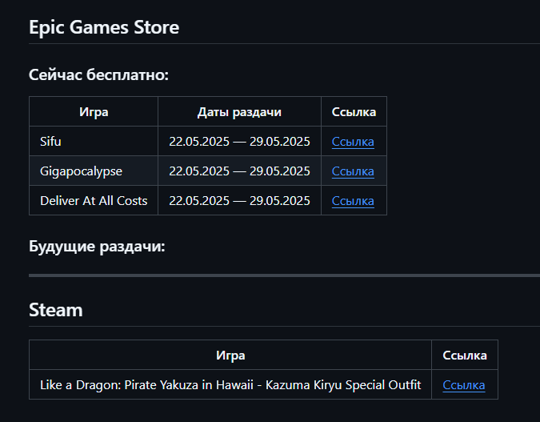

# Free Games Parser

Скрипт для получения бесплатных игр из **Epic Games Store** и **Steam**.

Этот проект собирает информацию о бесплатных играх, формирует отчёты в форматах **JSON** и **Markdown**, и сохраняет их в файлы.

---

## Файл FreeGames.md

Удобно, хорошо читабельный вывод.


---

## 🔧 Установка

1. Клонируй репозиторий или скачай архив с кодом.
2. Установи зависимости:

```bash
pip install -r requirements.txt
```

---

## 🚀 Использование

```bash
python main.py
```

После запуска ты получишь:

- `FreeGames.json` — файл со структурированной информацией о всех играх.
- `epic_games.md` — красиво отформатированный Markdown-отчёт.
- `logging.log` — лог-файл выполнения скрипта.

---

## 🗂 Структура проекта

```
.
├── main.py
├── parsers/
│   ├── __init__.py
│   ├── epicgames.py
│   └── steam.py
├── requirements.txt
├── FreeGames.json
├── epic_games.md
└── logging.log
```

---

## 📚 Использование парсеров отдельно

Вы можеште использовать функции парсинга и в своих проектах:

### Epic Games Store

```python
from parsers.epicgames import get_games_epicgames

games = get_games_epicgames(locale="ru", country="UA")
print(games)
```

### Steam

```python
from parsers.steam import get_games_steam

games = get_games_steam()
print(games)
```

Чтобы использовать только парсеры:

1. Помести папку `parsers` в свой проект.
2. Импортируйте нужную функцию и вызывайте.

---

## 🧩 Зависимости

Все зависимости перечислены в `requirements.txt`, вот основные:

- `requests`
- `beautifulsoup4`
- `lxml`
- `fake-useragent`

---

## 📜 Лицензия

Этот проект лицензирован по лицензии [MIT](LICENSE). Подробности смотри в файле LICENSE.
